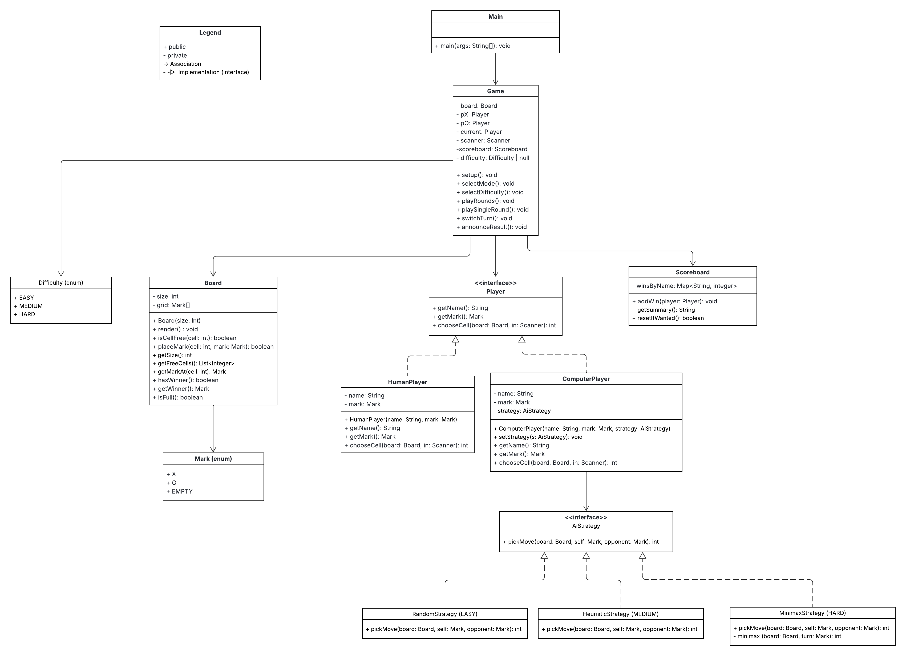

# Tic-Tac-Toe (Text-based, Java)

A two-player Tic-Tac-Toe game in the terminal, with optional computer opponent and difficulty levels.

## UML Diagram

## Legend
+ public  
- private  
→ Association  
-▷ Implementation (interface)

## Roadmap (MVP → VG)
- ✅ Two human players (terminal)
- ✅ Win/draw detection, input validation
- ✅ Restart after game ends
- ✅ OOP structure (Board, Game, Player, Scoreboard)
- ⭐ Names & turn prompts
- ⭐ Scoreboard (wins per player)
- ⭐ Input error handling (robust)
- ⭐ Computer player (Random / Heuristic / Minimax)
- ⭐ Difficulty selection (EASY / MEDIUM / HARD)

## Build & Run
Standard Java project (no external deps). Code lives under `src/`.
