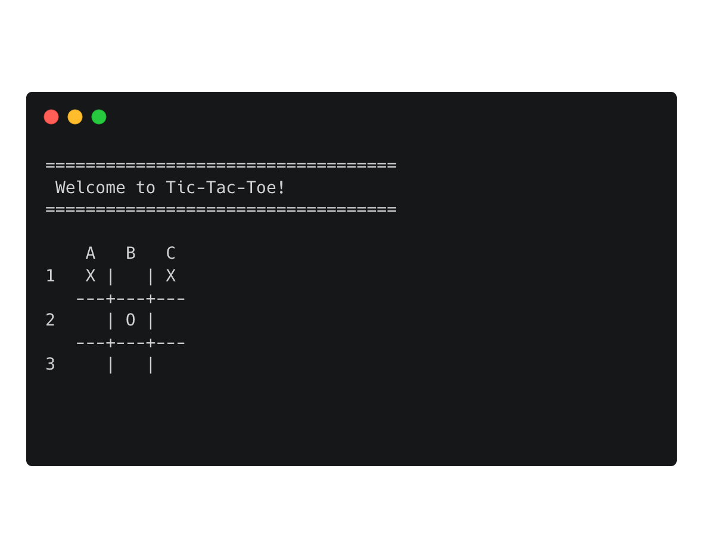
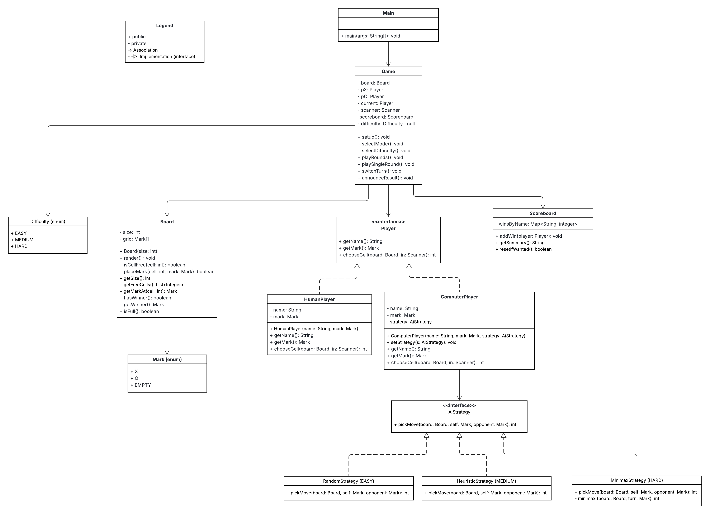

# 🎮 Tic-Tac-Toe (Text-based, Java)
_Developed as a school assignment at Folkuniversitetet._


Tic-Tac-Toe is a two-player game for the terminal, featuring an optional computer opponent with multiple difficulty levels,  
and support for dynamic board sizes (3×3 up to 10×10 in Human vs Human mode).

---

## 🧭 Table of Contents
- [🧩 UML Diagram](#-uml-diagram)
- [🧱 Project Structure](#-project-structure)
- [🤖 AI Overview](#-ai-overview)
- [⚙️ Design Decisions](#-design-decisions)
- [🧪 Testing Philosophy](#-testing-philosophy)
- [🏗 Build & Run](#-build--run)
- [🚀 Roadmap](#-roadmap)
- [💬 Lessons Learned](#-lessons-learned)
- [✨ Credits](#-credits)

---

## 🧩 UML Diagram
The UML diagram below illustrates the initial architecture of the project — showing how the main components such as the game logic, AI strategies, and player classes were planned to interact.  
It represents the foundation of the system design, created early in development to guide implementation.  
As the project evolved, new supporting classes were added to improve structure, readability, and to better align with clean coding principles.  
The diagram below captures that original design intent:



### Legend
\+ public  
\- private  
→ Association  
-▷ Implementation (interface)

[⬆ Back to top](#-table-of-contents)

---

## 🧱 Project Structure
The project is divided into packages for clarity and scalability:

- **ai** → AI strategies (Random, Heuristic, Minimax). Also contains Difficulty enum.
- **app** → Entry point and game loop (Main, Game).
- **model** → Core classes (Board, Scoreboard, Mark enum).
- **player** → Player interface + implementations (HumanPlayer, ComputerPlayer).
- **util** → Console helpers and shared utilities:
    - `ConsoleUI` (headings, colored messages, helpers)
    - `ConsoleColors` (ANSI color codes)
    - `Messages` (centralized prompts/errors)
    - `NameValidator` (validates and formats player names)
    - `CellParser` (parses inputs like `A1` → cell index)

### Why this structure?
- **Separation of concerns** → Each package has its own responsibility.
- **Scalability** → Easier to add new features, like new AI strategies.
- **Readability** → Other developers can quickly understand the flow.

###  Directory tree
```
src/
├── ai/
│   ├── AiStrategy.java
│   ├── Difficulty.java
│   ├── HeuristicStrategy.java
│   ├── MinimaxStrategy.java
│   └── RandomStrategy.java
├── app/
│   ├── Game.java
│   └── Main.java
├── model/
│   ├── Board.java
│   ├── Mark.java
│   └── Scoreboard.java
├── player/
│   ├── ComputerPlayer.java
│   ├── HumanPlayer.java
│   └── Player.java
└── util/
    ├── CellParser.java
    ├── ConsoleColors.java
    ├── ConsoleUI.java
    ├── Messages.java
    └── NameValidator.java
```
[⬆ Back to top](#-table-of-contents)

---

## 🤖 AI Overview

| Difficulty | Strategy Class | Description |
|-------------|----------------|--------------|
| **Easy** | `RandomStrategy` | Picks a random empty cell. Simple and unpredictable. |
| **Medium** | `HeuristicStrategy` | Blocks or extends potential winning lines — more defensive. |
| **Hard** | `MinimaxStrategy` | Evaluates all possible future states to find the best outcome. |

The AI system follows the **Strategy pattern**, allowing each difficulty level to use its own logic while the game loop stays the same.  
Currently, AI mode always runs on a **3×3 board**, ensuring quick and consistent decision-making.

[⬆ Back to top](#-table-of-contents)

---

## ⚙️ Design Decisions

Throughout the project, I focused on writing clean, modular, and testable code.  
Here are some of the key architectural and design decisions I made:

### 1. Clear Separation of Concerns
Each package (ai, app, model, player, util) has one well-defined purpose:
- `app` handles game flow and user interaction.
- `model` defines core data and rules.
- `player` abstracts human and AI behavior.
- `ai` provides interchangeable strategy implementations.
- `util` centralizes helpers and shared logic.

### 2. Strategy Pattern for AI
The AI uses the **Strategy Pattern**, allowing multiple difficulty levels to share the same interface (`AiStrategy`).  
This made it easy to plug in `Random`, `Heuristic`, or `Minimax` behavior without changing the game loop.

### 3. Single Responsibility Principle (SRP)
Each class has one clear responsibility:
- `Board` → Manages game state and win logic.
- `Game` → Controls the main loop.
- `Menu` → Handles user input before and after a game.
- `ConsoleUI` → Displays formatted messages.

### 4. Centralized Validation & Error Messages
All user-facing text (prompts and errors) are defined in `Messages.java`.  
This reduces duplication and makes future localization easy.

### 5. Testability by Design
Objects such as `Scanner` and `AiStrategy` are injected, not hardcoded.  
This makes classes modular and easy to test in isolation with JUnit.

### 6. Extensibility in Mind
The `Board` class supports dynamic sizes (3–10), which lays the foundation for larger board modes or “4-in-a-row” expansions.

[⬆ Back to top](#-table-of-contents)

---

## 🧪 Testing Philosophy

Unit tests are written with **JUnit 5**.  
The test sources live under `test/` with the same package structure as `src/`.

### Directory tree (tests)
```
test/
├── ai/
│   ├── RandomStrategyTest.java
│   ├── HeuristicStrategyTest.java
│   ├── MinimaxStrategyTest.java
├── app/
│   ├── GameTest.java
│   ├── MenuTest.java
├── model/
│   ├── BoardTest.java
│   ├── ScoreboardTest.java
├── player/
│   ├── ComputerPlayerTest.java
│   ├── HumanPlayerTest.java
└── util/
    ├── CellParserTest.java
    ├── ConsoleUITest.java
    ├── MessagesTest.java
    ├── NameValidatorTest.java
```

### Run tests
- In IntelliJ: right-click on `test/` ➜ **Run 'All Tests'**
- Or via Maven/Gradle if you add a build tool later (e.g., `mvn test`)

### Current coverage
- **BoardTest** → placing marks, win conditions (row, column, diagonals), full board, invalid moves.
- **ScoreboardTest** → tracking wins per player and multiple players.
- **NameValidatorTest** → ensures valid/invalid names behave correctly.
- **HumanPlayerTest** → tests player input and constructor validation.
- **ComputerPlayerTest** → ensures AI moves only in valid, empty cells.
- **RandomStrategyTest** → verifies AI always returns valid empty cells.
- **GameTest** → full end-to-end simulation:
    - Player X winning a game (includes board size selection)
    - Draw scenario
    - Playing vs Computer (all difficulty levels)
    - Scoreboard and restart flow

> 💡 *Goal: not just coverage, but confidence — if something breaks, tests immediately reveal where.*

[⬆ Back to top](#-table-of-contents)

---

## 🏗 Build & Run
Standard Java project (no external dependencies). Code lives under `src/`.

### Run in IntelliJ
Right-click on `Main.java` → **Run 'Main'**

### Run via terminal
```
javac -d out src/**/*.java
java -cp out app.Main
```

### How to play (input)
Enter moves in the format **Column + Row**, e.g. `A1`, `B2`, `C3`.

In Human vs Human mode, you can now choose the board size (3–10).
The computer opponent always plays on a standard 3×3 board.

#### Empty board
```
    A   B   C
1     |   |  
   ---+---+---
2     |   |  
   ---+---+---
3     |   |  
```
#### Example mid-game
```
    A   B   C
1   X | O |  
   ---+---+---
2     | X |  
   ---+---+---
3   O |   | X
```
[⬆ Back to top](#-table-of-contents)

---

## 🚀 Roadmap
* ✅ Two human players (terminal)
* ✅ Win/draw detection, input validation
* ✅ Restart after game ends
* ✅ OOP structure (Board, Game, Player, Scoreboard)
* ✅ JUnit tests for Board and Scoreboard
* ✅ Names & turn prompts
* ✅ Input error handling (robust)
* ✅ Computer player (Random / Heuristic / Minimax)
* ✅ Difficulty selection (EASY / MEDIUM / HARD)
* ✅ Dynamic board size selection (3–10) for Human vs Human mode

### Future improvements:
-	Persistent player statistics
-	Monthly challenges or mini-tournaments
-	Enhanced AI logic for larger boards

[⬆ Back to top](#-table-of-contents)

---

## 💬 Lessons Learned
-	Deepened understanding of object-oriented design and encapsulation.
-	Practiced test-driven development principles through iterative testing.
-	Learned to apply design patterns like Strategy and SRP effectively.
-	Improved ability to debug and refactor safely using unit tests.
-	Realized how structure and readability are key for long-term maintainability.

[⬆ Back to top](#-table-of-contents)

---

## ✨ Credits

### Content
All code in this project was written by Linnéa Ternevik (2025).

### Code Support
- AI tools (e.g. ChatGPT) were used occasionally for debugging assistance,
code reviews, and documentation improvements.

### Media
- [Carbon](https://carbon.now.sh) was used to create the terminal mockup image included in this README.
- [Lucidchart](https://www.lucidchart.com) was used to create the UML diagram.

---

✨ _Best wishes and happy coding!_

**Linnéa Ternevik**

[⬆ Back to top](#-table-of-contents)

